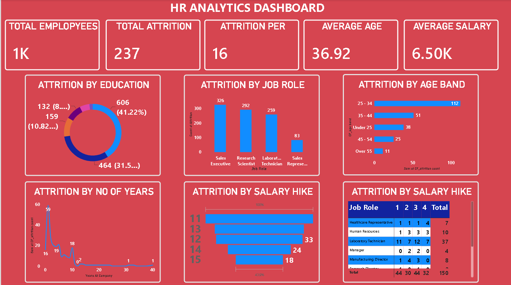

# HR Analytics Dashboard

## 📊 Project Overview

This project is an HR Analytics Dashboard created using Microsoft Power BI.

The dashboard analyzes employee data and provides insights into employee attrition, demographics, departments, job roles, salary and workforce trends.

## 🛠️ Tools Used

- Power BI
- Microsoft Excel
- Power Query
- DAX

## 📌 Key Analysis

- Total Employees
- Employee Attrition
- Attrition Rate
- Average Salary
- Average Employee Age
- Department-wise Employee Analysis
- Job Role Analysis
- Gender-wise Analysis
- Education Analysis
- Employee Demographics

## 📈 Dashboard Features

- Interactive KPI cards
- Charts and visualizations
- Slicers and filters
- Department analysis
- Job role analysis
- Attrition analysis
- Employee demographic analysis

## 💡 Skills Demonstrated

- Data Cleaning
- Data Transformation
- Data Analysis
- Data Visualization
- Data Modeling
- DAX
- Power BI Dashboard Development

## 📷 Dashboard Preview

## 📁 Project Files

- `HR_Analytics_Dashboard.pbix` - Power BI dashboard
- `HR-Dashboard.png` - Dashboard screenshot

## 🎯 Objective

The objective of this project is to demonstrate practical data analytics skills by transforming HR data into an interactive Power BI dashboard and presenting meaningful workforce insights.
